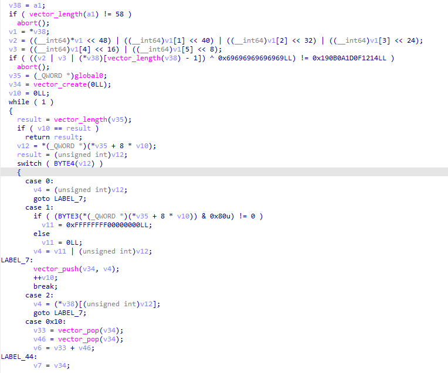

## Move Bytecode LLVM Compiler
This program compiles move bytecode to x86 code. It can be used for move bytecode analysis, as x86 is much easier to decompile than move-vm's language.

## Missing Features
- Not all bytecodes are implemented
- Currently, all `vector` types use the same `vector_*` methods. Implement vector methods for each inner type.

## Example Outcome
- The following is IDA output when this program is fed [message.mv](../ctf-sol/message.mv) from PBCTF-2023's move-vm challenge.

```bash
# Compile move bytecode to x86 object file
cargo run -- -i message.mv -o message.so
# Decompile message.so with IDA
```

- Output: 
